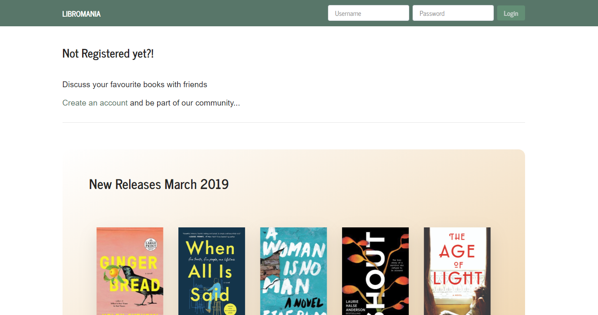
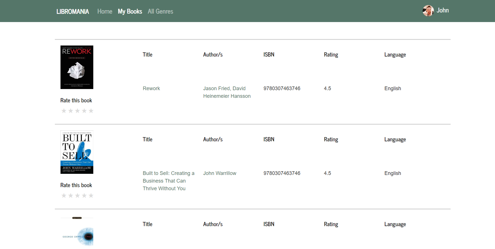
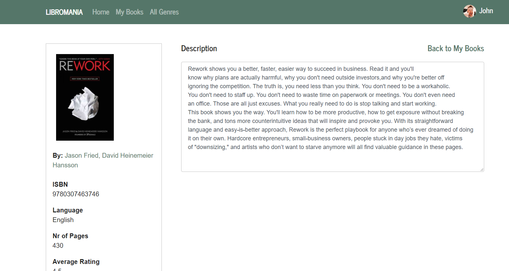
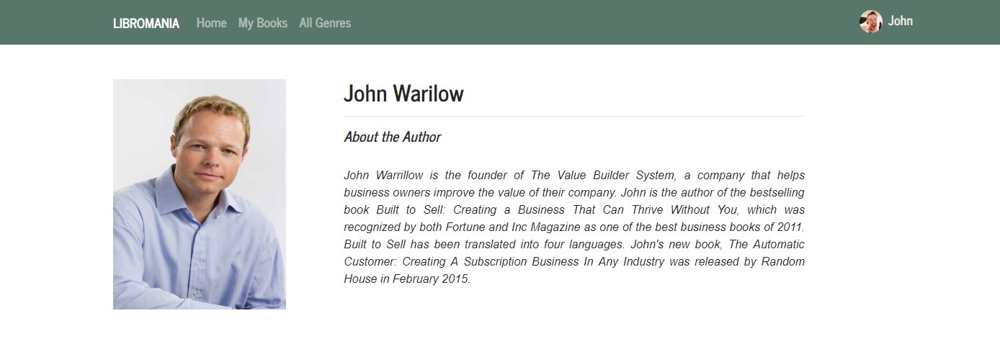
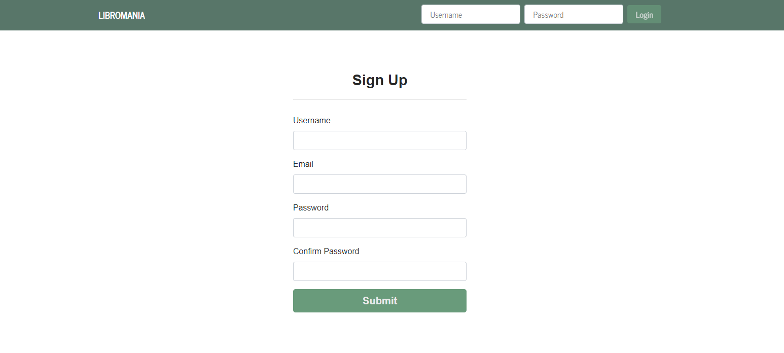

# Lrm

Running the Server Side - Symfony Framework

1. Download inside an Apache Server and make sure that PHP version >= 7.1.3.
2. Create a local db and import 'lrm_db' located in this repo.
3. Use 'Composer' to update the dependencies inside the Lrm.API folder by running 'Composer update'.
4. Edit the Lrm.API/app/config/parameters.yml with your local DB connection data.

Running the Client Side - Angular Framework

1. Run 'npm install' inside the Lrm.SPA folder
2. Go to: "Lrm.API/src/app/environments/global.ts" and update to the API endpoint (currently: 'http://localhost/Lrm.API/web/app_dev.php').
3. Run 'npm start'.
4. Go to  'http://localhost:4200/' in your browser.

Here is how the app will look:

To log in use credentials
username: 'admin@admin.com'
password: 'admin'

Some other images of the App:

